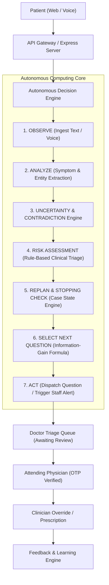

# CAREPATH AI — Architecture Specification

## 1. System Overview
CAREPATH AI is architected as an autonomous patient case-taking and clinical decision-support platform designed to operate deterministically on edge servers or serverless environments.

## 2. Core Autonomous Engines
1. **Case State Engine (`engines/caseStateEngine.js`)**:
   - Maintains canonical case state across 6 clinical dimensions.
   - Detects linguistic uncertainty markers across English, Hindi, and Telugu.
   - Detects testimony contradictions (timeline shifts, pain score swings, symptom denials).
   - Evaluates stopping criteria (high risk escalation, clinical sufficiency, question ceiling).

2. **Autonomous Decision Engine (`engines/autonomousDecisionEngine.js`)**:
   - Orchestrates the full lifecycle: `OBSERVE → ANALYZE → UNCERTAINTY → CONTRADICTION → RISK → REPLAN → SELECT → ACT`.
   - Records immutable, auditable decision trace events for every cognitive step.
   - Dispatches emergency staff alerts when high priority criteria are satisfied.

3. **Question Selection Engine (`engines/questionSelectionEngine.js`)**:
   - Implements mathematical scoring:
     $$\text{Score} = \text{InformationGain} + \text{RiskRelevance} + \text{Missingness} + \text{ContradictionResolution} + \text{SymptomRelevance} - \text{Penalty}$$
   - Filters out already answered questions and ranks the top 5 candidates.

4. **Clinical Risk Assessment Engine (`engines/riskAssessmentEngine.js`)**:
   - Evaluates symptoms, vitals (BP, HR, SpO2, Temp), duration, and severity against non-diagnostic emergency thresholds.
   - Stratifies cases into `ROUTINE`, `URGENT`, and `HIGH`.

5. **Fixed-Question Baseline Engine (`engines/baselineEngine.js`)**:
   - Benchmarks autonomous case taking against the traditional 20-question fixed intake checklist.
   - Computes questionnaire reduction percentage and estimated triage time savings.
