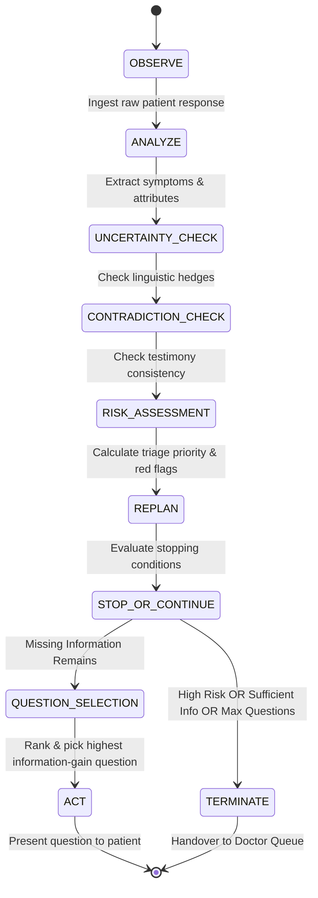

# CAREPATH AI — Autonomous Case-Taking Loop

## 1. Loop Lifecycle
CAREPATH AI executes an explicit 8-stage autonomous computing loop on every patient turn:

## 2. Mathematical Question Selection Formula
Candidate questions from `questionsCatalog` are evaluated deterministically using:

$$\text{Score}(Q) = \Delta I(Q) + R(Q) + M(Q) + C(Q) + S(Q) - P(Q)$$

Where:
* $\Delta I(Q)$: Base Information Gain ($0.20$ to $0.55$)
* $R(Q)$: Clinical Risk Relevance ($0.20$ if acute presentation)
* $M(Q)$: Target attribute missingness ($0.35$ if currently missing, $-50$ if already opportunistically captured)
* $C(Q)$: Contradiction resolution bonus ($0.40$ if testimony conflict detected on this dimension)
* $S(Q)$: Category priority alignment ($0.05$ to $0.40$ based on presentation)
* $P(Q)$: Already asked penalty ($-100$ if previously answered)

## 3. Stopping Conditions
Questioning halts immediately when ANY of the following 3 criteria is met:
1. **HIGH_RISK_ESCALATION**: Priority is `HIGH` and $\ge 2$ questions have been answered. Immediate clinician alert is dispatched.
2. **SUFFICIENT_INFORMATION**: Chief complaint, timeline, and severity are known, with $\ge 3$ questions answered.
3. **MAX_QUESTIONS_REACHED**: Hard ceiling of 6 questions reached to prevent cognitive fatigue.
